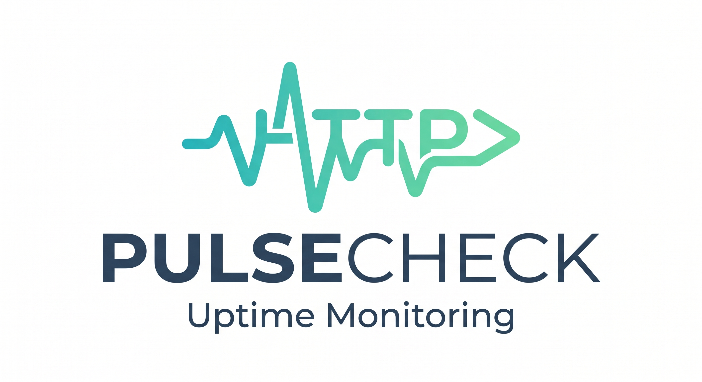

<p align="center">
  
</p>

# PulseCheck

Uptime & API performance monitoring, built as a full-stack SaaS project.

Live demo: [pulsecheck-web-beige.vercel.app](https://pulsecheck-web-beige.vercel.app)

## What it does

PulseCheck lets you register HTTP endpoints and monitors their uptime and response time on a schedule. When a monitor's status changes (up/down), users are notified in real time on the dashboard and via email or Telegram.

- **Add & manage monitors** — track any URL, see live status on a dashboard
- **Scheduled pinging** — a dedicated worker service checks each monitor on interval, using Redis locks to avoid duplicate pings across instances
- **Real-time dashboard** — status and activity updates pushed over WebSocket, no manual refresh
- **Activity charts** — response-time history per monitor, with a compare-two-monitors overlay view
- **Notifications** — email (via Resend) and Telegram alerts on status change, with a one-time-link flow to connect a Telegram account
- **Auth** — JWT-based register/login/refresh flow
- **Per-user timezone** — notification timestamps shown in the user's local time

## Architecture

```
┌──────────┐     ┌──────────┐     ┌──────────────┐
│   web    │────▶│   api    │────▶│  PostgreSQL  │  (users, monitors, notifications)
│ (Next.js)│◀────│ (NestJS) │     └──────────────┘
└──────────┘ WS  │          │────▶┌──────────────┐
                  │          │     │   MongoDB    │  (ping/time-series results)
                  │          └────▶└──────────────┘
                  │          │────▶┌──────────────┐
                  │          │     │    Redis     │  (scheduling locks)
                  └────┬─────┘     └──────────────┘
                       │
                       ▼
                ┌─────────────┐      ┌──────────┐
                │  RabbitMQ   │─────▶│  worker  │  (pings monitors, writes results)
                │ (task queue)│      └──────────┘
                └──────┬──────┘
                       ▼
                ┌─────────────┐
                │  notifier   │  (email / Telegram on status change)
                └─────────────┘
```

Four independently deployable services in one repo, communicating over RabbitMQ.

## Tech stack

| Layer | Tech |
|---|---|
| Frontend | Next.js, TypeScript, CSS Modules, WebSocket client |
| API | NestJS, Prisma (PostgreSQL), Mongoose (MongoDB), JWT auth |
| Worker | NestJS, ioredis, RabbitMQ consumer |
| Notifier | NestJS, Resend (email), Telegram Bot API |
| Infra | Docker, docker-compose, GitHub Actions CI |
| Testing | Jest (unit), Supertest (e2e) |

## Project structure

```
apps/
  api/        NestJS REST + WebSocket API, Prisma + Mongoose
  worker/     Scheduled ping worker (RabbitMQ consumer)
  notifier/   Email + Telegram notification service
  web/        Next.js dashboard
docs/
  api_contract.yaml   API spec
  ARCHITECTURE.md
```

## Running locally

Requires Docker.

```bash
git clone https://github.com/444vv2/PulseCheck.git
cd PulseCheck
docker-compose up --build
```

This starts all four app services plus PostgreSQL, MongoDB, Redis, and RabbitMQ. Prisma migrations run automatically on API startup.

The web dashboard will be available at `http://localhost:3000` (check `docker-compose.yml` for exact ports and required env vars per service).

## Testing

```bash
npm run test --workspace=@pulsecheck/api        # unit tests
npm run test:e2e --workspace=@pulsecheck/api    # e2e tests, against a local test DB
npm run test --workspace=worker
npm run test --workspace=notifier
```

## CI/CD

GitHub Actions runs on every push/PR to `main`: unit tests for all three backend services, e2e tests for the API against a real Postgres service container, and a production build for all four apps. `main` is protected — merging requires the CI check to pass.

`web` deploys to Vercel and `api`/`worker`/`notifier` deploy to Railway, both via their own git integrations.

## Status

All core features are implemented and deployed: auth, monitor CRUD, scheduled pinging, real-time dashboard, activity charts, email + Telegram notifications, and CI/CD.
